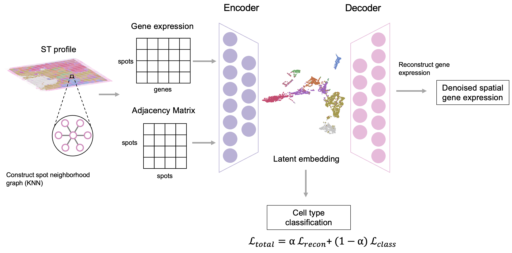
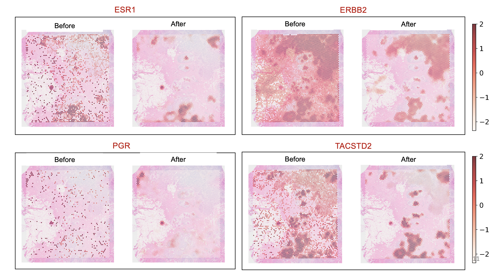
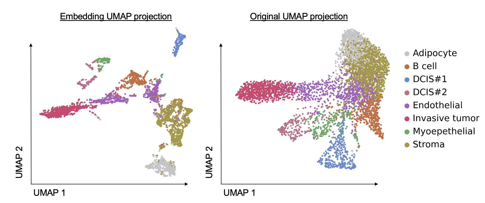

# GAE
# Denoising Spatially Resolved Transcriptomics Data Using Graph Auto-Encoders

This repository contains a PyTorch-based **Graph Attention Auto-Encoder (GAE)** framework designed to denoise spatially resolved transcriptomics (ST) data and perform spot-level cell type classification. 

Adapted and optimized from **STAGATE** (Dong & Zhang, 2022), this model shifts the application of spatial GAEs from domain identification to joint representation learning, expression profile denoising, and spot-level supervised cell type classification.

---

## Project Overview & Background

Spatial transcriptomics (ST) technologies, such as the 10X Genomics Visium platform, capture gene expression profiles while preserving their physical coordinate contexts ($x, y$ coordinates). However, Visium does not operate at single-cell resolution; each spot contains a mixture of multiple cell types. Technical noise and experimental artifacts also introduce significant variance, obscuring true biological signals.

This project implements a Graph Neural Network (GNN) to leverage spatial coordinates:
*   **Message Passing**: Information is propagated between neighboring spots to incorporate spatial microenvironment contexts.
*   **Joint Training**: Spot representation learning, denoising (auto-encoder reconstruction), and cell-type classification are optimized simultaneously.

---

## Model Architecture

The GAE is implemented as a Graph Attention Network (GAT) using PyTorch:

*   **Encoder**: Consists of two Graph Attention Convolutional layers (`GATConv`) that integrate spot-level gene expression and the spatial adjacency matrix to compress features into a 32-dimensional latent embedding ($Z$).
*   **Decoder**: Reconstructs the 32-dimensional latent embedding ($Z$) back into the original gene expression space using two GAT convolutional layers with tied weights matching the encoder.
*   **Classifier**: Mapped directly from the latent embedding $Z$, a linear classification layer followed by a Softmax activation produces spot-level cell-type probabilities.

---

## Adjacency Graph Construction

The spatial transcriptomic slide is modeled as an undirected graph $\mathcal{G} = (\mathcal{V}, \mathcal{E})$:
*   **Nodes ($\mathcal{V}$)**: Represent individual sequencing spots.
*   **Edges ($\mathcal{E}$)**: Configured using a $K$-Nearest Neighbor (KNN) spatial graph (with $K=5$ or $K=6$) based on the Euclidean distances of spatial coordinates (`adata.obsm['spatial']`).
*   The adjacency matrix is converted to an undirected graph to ensure bidirectional information flow during message passing.

---
Usage 1: Spatial Expression Denoising

Usage2: Spatial Clustering and better cell typing 

---
## Dependencies
*   Python 3.9+
*   PyTorch & PyTorch Geometric (for MessagePassing and GNN layers)
*   Scanpy (for single-cell and spatial analysis)
*   AnnData
*   scikit-learn
*   pandas
*   numpy
*   matplotlib
*   seaborn
*   Pillow (PIL)

---

## References

1. Dong, Kangning, and Zhang, Shihua. *"Deciphering spatial domains from spatially resolved transcriptomics with an attention-based graph autoencoder."* Nature Communications 13.1 (2022): 2203. (STAGATE basis)
2. 10X Genomics Human Breast Cancer FFPE Dataset: https://www.10xgenomics.com
